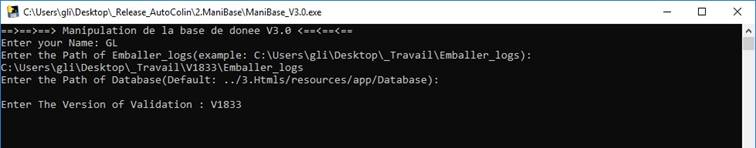

 

|      |                                         |
| ---- | --------------------------------------- |
|      |  |

Table des matières

[1.Présentation.................................................................................................................... 3](#_Toc16094)

[2. Spécifications.................................................................................................................. 4](#_Toc16095)

[3. Modes  opératoires.......................................................................................................... 5](#_Toc16096)

[3.1 Les outils de  préparation............................................................................................ 5](#_Toc16097)

[3.2 L’outil  concernant de la base de données.................................................................... 5](#_Toc16098)

[L’algorithme de  ManiBase................................................................................................ 8](#_Toc16099)

[3.3 L’affichage  exécutable: eleadas................................................................................... 9](#_Toc16100)

[3.3.1 En bref................................................................................................................ 9](#_Toc16101)

[3.3.2 la fenêtre  d’accueil : détails................................................................................ 10](#_Toc16102)

[3.3.3 la fenêtre  d’analyse........................................................................................... 12](#_Toc16103)

[3.3.4 la fenêtre  d’évolution......................................................................................... 14](#_Toc16104)

[3.3.5 Exporter  l’affichage HTML.................................................................................. 15](#_Toc16105)

[L’algorithme de  l’affichage exécutable............................................................................ 16](#_Toc16106)

[3.4 L’affichage  HTML...................................................................................................... 17](#_Toc16107)

[3.4.1 En bref.............................................................................................................. 17](#_Toc16108)

[3.4.2 Menu de  navigation........................................................................................... 17](#_Toc16109)

[3.4.3 index.html  : l’évolution du développement......................................................... 18](#_Toc16110)

[3.4.4  details.html: les informations détaillées.............................................................. 19](#_Toc16111)

[3.3.3 la fenêtre  d’analyse........................................................................................... 22](#_Toc16112)

 

# 1.Présentation

L’AutoColin V2.0, livré le 06/09/2018, est une série des outils qui nous permettent d’automatiser le process de validation des fusions données. Il est intégré profondément dans le flux de travail (figure 1). Avec cet outil, nous pouvons gagner :

•    De 1,5 jour-homme d’analyse à presque 0,0

•    De 15 jour-homme de validation par version à 10,75

En total, il nous permet de gagner presque 5,75 jour-homme pour chaque version de validation.

# 2. Spécifications

L’outil consiste en trois parties principales :

\1.   Les outils de préparation

a.   Emballer_V10.exe : copier tous les fichiers logs qui existent dans toutes les sousrépertoires à partir de celle où se trouve l’application dans un dossier nommé <<Emballer_logs>>.

b.   Suprimer_V10.exe : d’après l’étape au-dessus, supprimer tous les fichiers logs qui existent dans toutes les sous-répertoires à partir de celle où se trouve l’application**.**

\2.   L’outil concernant de la base de données : 

a.   ManiBase_V3.0.exe :

i.    Configuration personnelle

ii.   Lire des fichiers logs

iii.  Enregistrement dans la base de données (SQLite) iv.   Analyser des scénarios enregistrés

​                   v.  Compresser et ranger des images

b.   pngquant.exe : l’extension permet de la compression d’image

\3.   L’affichage exécutable: eleadas.exe

a.   Afficher des enregistrements des scénarios

b.   Afficher les analyses statistiques de chaque version ainsi que l’évolution de développement.

c.   Afficher des résultats selon 16280 (13X10X44+2X10X10X44+4X10X44) combinaisons de triages différents. 

d.   Afficher des détails (images) de scénarios en cliquant sur la ligne.

e.   Exporter des pages sous forme de HTML sans communication avec le database.

\4.   L’affichage HTML

a.   Afficher des enregistrements des scénarios

b.   Afficher les analyses statistiques de chaque version ainsi que l’évolution de développement.

c.   Afficher des résultats selon 16280 (13X10X44+2X10X10X44+4X10X44) combinaisons de triages différents. 

d.   Afficher des détails (images) de scénarios en cliquant sur la ligne.

# 3. Modes opératoires

## 3.1 Les outils de préparation

Cette partie consiste en deux applications exécutables (Figure 2):

*Figure 2*

En double cliquant sur **Emballer_V10.exe**, deux tâches se fait séquentiellement :

\1.   Création d’un répertoire qui s’appelle < Emballer_logs > dans le même niveau de l’application 

\2.   Trouver tous les fichiers log dans tous les sous-répertoires et puis les copier à < 

Emballer_logs >. S’il existe un fichier log avec le même nom, le renommer automatiquement en ajoutant <ms>

Supprimer_V10.exe nous permet de supprimer tous les fichiers log qui existe dans les sousrépertoires à partir duquel où se trouve l’application.

## 3.2 L’outil concernant de la base de données

Cette partie consiste en qu’une seule application exécutable, l’autre est une extension de celle (Figure 3):

*Figure 3*

pngquant.exe est l’extension qui sert à compresser des images en quatrième la taille.

En double cliquant sur ManiBase_V3.0.exe, il nous apparaît une fenêtre comme ci-après (Figure 4):

*Figure 4*

Il nous permet d’entrer des configurations personnelles. Suivre des indications, nous entrons l’un par l’autre (Figure 5):

\1.   Nom de l’utilisateur

\2.   Le path absolu de << Emballer_logs >>

\3.   Le path de la base de données. Si la structure de répertoire n’est pas changée, il est par défaut mis à <<../3.Htmls/resources/app/Database>> qui est le path database de l’application d’affichage. Cela nous éviter de copier les fichiers encore une fois.

\4.   La version de validation à enregistrer.

Un exemple :

*Figure 5*

En tapant <<Enter>>, un nouveau fichier << ADASet.ini >> est créé (Figure 6):

*Figure 6*

Cela nous facilite la configuration au début. C’est-à-dire par exemple la fois prochaine si on entre le nom <<GL>>, on arrive directement à l’étape d’entrer la version (Figure 7):

*Figure 7*

Et ensuite, les tâches se fait à l’ordre, en bref :

\1.    ManiBase_V3.0.exe lit ligne par ligne des fichiers logs pour trouver des mots clés en respectant certaines règles afin d’enregistrer les infos des scénarios dans la base de données.

\2.    Analyser des scénarios et puis enregistrer les résultats d’analyse dans la base de données

\3.    Déplacer des images dans un sous-répertoire de <<Database>>. Archiver tous les fichiers logs dans un même txt.

D’âpre le lancement, le structure de <<Database>> sera comme ci-après (Figure 8) :

*Figure 8*

DataAdas.db est le fichier de la base de données. Dans le répertoire <<img_log>> se trouvent tous les images avec une identité unique (Figure 9)

*Figure 9*

Chaque image est numérotée selon son enregistrement correspondant dans la base de données.

## L’algorithme de ManiBase

Ci-après se trouve son algorithme de travail (Figure 10) :

*Figure 10*

## 3.3 L’affichage exécutable: eleadas

Avant le lancement de l’outil, faut qu’on soit sûr que la base de données se trouve dans le sousrépertoire : 

……\3.Htmls\resources\app\Database\

Dès l’affichage exécutable lancera, la base de donnée sera automatiquement connectée.

**Remarque :**

Si le structure de répertoire de l’AutoColin n’est pas changé, il est placé proprement par défaut d’après l’application ManiBase_V3.0.exe.

En double cliquant sur la fichier exécutable, eleadas.exe, on aura deux interfaces :

\1.    Une fenêtre pour afficher l’évolution du développement

\2.    Une autre fenêtre pour afficher les détails de scénarios

### 3.3.1 En bref

Il y a 3 fenêtres principales, une sous-fenêtre l’affichage d’image, donc 4 fenêtres en total :

\1.   Fenêtre principale : détail (figure 12)

​            a.  Sous-fenêtre : images de bug (figure 14)

\2.   Fenêtre principale : évolution (figure 13)

\3.   Fenêtre principale : analyse (figure 11)

### 3.3.2 la fenêtre d’accueil : détails

Pour l’affichage exécutable, l’interface d’accueil est la fenêtre qui nous affiche les détails des bugs. Les commandes se trouvent en haut de la page (figure 15)

Une fois les versions sont affichées, on peut cliquer sur le bouton Jaune <<Get>> pour affichage tous les datas de la version choisie (Figure 17) et en même temps l’indication est changé pour montrer le triage choisie actuel (Figure 16).

##### 3.3.2.2 Trier les infos d’une version choisie

Cliquer sur le bouton <<Triage>>, il nous apparaît les commandes de triage (figure 18).

*Figure 18*

Choisir la combinaison de triage comme nous voulons. Il y a 16280 (13X10X44 + 2X10X10X44 + 4X10X44) combinaisons de triage en total :

**1.**    Pour le type d’entrée : 4

**2.**    Pour le type de scénario, la liste change selon le choix de type d’entrée :

**a.**   Roulage – 4

**b.**   Simobj normal - 10

**c.**   Simobj parfait - 10

**d.**   Tous - 13

**3.**    Pour le type de module : 10

**4.**    Pour le type de bug : 44

Une fois le choix se fait, cliquer sur <<Go>> pour afficher les résultats de cette combinaison de triage.

Et en même temps, deux autre tâches se fait automatiquement (figure 19)

\1.   L’indication corresponds à la combinaison de triage

\2.   La condition de tri est ajoutée dans la liste de <<Historique>> qui nous permet de revenir sur la combinaison précédente.

*Figure 19*

Après il nous donnée soit un tableau des cas (figure 20), soit une indication pour dire qu’il n’y pas de cas pour cette condition de tri (figure 21).

*Figure 20*

*Figure 21*

##### 3.3.2.3 afficher les détails d’un bug

En cliquant sur une ligne de bug, une autre fenêtre est affichée pour montrer les détails de bug sur lequel est cliqué (Figure 22).

Il y a des images et aussi des détails supplémentaires de ce bug.

*Figure 22*

### 3.3.3 la fenêtre d’analyse

Faut qu’on choisisse la version d’abord (figure 23), et puis cliquer sur <<analyses>> pour affricher les analyses de cette version.

*Figure 23*

La page d’analyse consiste selon des types d’entrée en trois parties : Roulage, Simobj-Normal, Simobj-Parfait. Chaque partie est équipée de deux diagramme :

\1.   Un diagramme pour montrer les chiffres à l’ordre descente par le numéro de bug (figure 24):

a.   La quantité de chaque bug

b.   La quantité de chaque bug / la quantité totale de scénarios

c.   La quantité de chaque bug / les heures totales parcourues

d.   La quantité de chaque bug / la distance totales parcourue

\2.   Un autre diagramme pour montrer le pourcentage de la quantité de chaque bug sur la quantité totale de bug à l’ordre descente par le pourcentage (figure 25)

*Figure 24*

*Figure 25*

### 3.3.4 la fenêtre d’évolution

La page d’évolution est ouverte dès le début de lancement du programme. Elle peut aussi être ouverte en cliquant le bouton <<Evolution>>. Cette page commence avec le taux de succès, et consiste aussi selon des types d’entrée en trois parties : Roulage, Simobj-Normal, Simobj-Parfait. 

Chaque partie est équipée de 5 diagrammes :

a.   La quantité de chaque bug

b.   La quantité de chaque bug / la quantité totale de scénarios

c.   La quantité de chaque bug / les heures totales parcourues

d.   La quantité de chaque bug / la distance totales parcourue

e.   La quantité de chaque bug / la quantité totale de bug

Et l’axe X se trouve toutes les versions. La tendance d’évolution donc se voit évidemment

Il est au début n’affiche que le bug le plus fréquent (figure 26). C’est-à-dire le bug dont le sum des chiffres de ce bug de toute les versions est le plus grand est affiché. Il y a aussi un bouton <<select all>> pour afficher tous les bugs (figure 27). Et pour afficher plus de bug, cliquer sur la flèche en bas à droite.

### 3.3.5 Exporter l’affichage HTML 

Revenir sur la page de détail et cliquer à droite sur n’importe où et puis choisir <<Save as HTML>> (figure 29). Ensuite sélectionner un répertoire (figure 28).

*Figure 28*

*Figure 29*

*Figure 30*

Ensuite, le système nous enregistre automatiquement avec un feed-back (figure 30)

## L’algorithme de l’affichage exécutable

Ci-après se trouve son algorithme de travail (Figure 31):

*Figure 31*

## 3.4 L’affichage HTML

### 3.4.1 En bref

Sous le répertoire 4 fichiers HTML (Figure32):

\1.   Analyse.html : les analyses d’une version

\2.   Details.html : toutes les infos des versions.

\3.   Images.html : sous-fenêtre de détails.html pour afficher les images etc.

\4.   Index.html : la page d’accueil pour tout d’abord afficher l’évolution du développement.

Il y a aussi un répertoire qui s’appelle <<libHtmls>> (Figure 33) où se trouvent tous les composants indispensables des pages HTMLs.

                                 *Figure 33*

Pour afficher les images, faut qu’on copie la base de données dans le même répertoire où se trouvent des pages HTMLs. Et suite, lancer l’affichage HTML en cliquant <<index.html>>.

### 3.4.2 Menu de navigation 

Le menu de navigation qui se trouve en haut à gauche nous permet d’aller sur l’autre page web.

Il est toujours fixé en haut de la page avec des commandes dédiées aux fonctionnements (Figure 34).

*Figure 34*

### 3.4.3 index.html : l’évolution du développement

La page d’évolution commence avec le taux de succès (figure 36), et consiste aussi selon des types d’entrée en trois parties : Roulage, Simobj-Normal, Simobj-Parfait. Chaque partie est équipée de 5 diagrammes :

a.   La quantité de chaque bug

b.   La quantité de chaque bug / la quantité totale de scénarios

c.   La quantité de chaque bug / les heures totales parcourues

d.   La quantité de chaque bug / la distance totales parcourue

e.   La quantité de chaque bug / la quantité totale de bug

Et l’axe X se trouve toutes les versions. La tendance d’évolution donc se voit évidemment.

Il est au début n’affiche que le bug le plus fréquent (figure 35). C’est-à-dire le bug dont le sum des chiffres de ce bug de toute les versions est le plus grand est affiché. Il y a aussi un bouton <<select all>> pour afficher tous les bugs (figure 37). Et pour afficher plus de bug, cliquer sur la flèche en bas à droite.

                     *Figure 36*                                

### 3.4.4 details.html: les informations détaillées

Au début, la page Html lance automatiquement les versions enregistrées. Les commandes se trouvent en haut de la page (figure 38) il y a moins de commandes par rapport à la version exécutable

*Figure 38*

##### 3.4.4.1 Afficher tous les infos d’une version choisie

Une fois les versions sont affichées, on peut cliquer sur le bouton Jaune <<Get>> pour affichage tous les datas de la version choisie (Figure 40) et en même temps l’indication est changé pour montrer le triage choisie actuel (Figure 39).

##### 3.4.4.2 Trier les infos d’une version choisie 

Cliquer sur le bouton <<Triage>>, il nous apparaît les commandes de triage (figure 41).

*Figure 41*

Choisir la combinaison de triage comme nous voulons. Il y a 16280 (13X10X44 + 2X10X10X44 + 4X10X44) combinaisons de triage en total :

**1.**    Pour le type d’entrée : 4

**2.**    Pour le type de scénario, la liste change selon le choix de type d’entrée : 

**a.**   Roulage – 4

**b.**   Simobj normal - 10

**c.**   Simobj parfait - 10

**d.**   Tous - 13

**3.**    Pour le type de module : 10

**4.**    Pour le type de bug : 44

Une fois le choix se fait, cliquer sur <<Go>> pour afficher les résultats de cette combinaison de triage. 

Et en même temps, deux autre tâches se fait automatiquement (figure 42)

\1.   L’indication corresponds à la combinaison de triage

\2.   La condition de tri est ajoutée dans la liste de <<Historique>> qui nous permet de revenir sur la combinaison précédente.

*Figure 42*

Après il nous donnée soit un tableau des cas (figure 43), soit une indication pour dire qu’il n’y pas de cas pour cette condition de tri (figure 44).

*Figure 43*

*Figure 44*

##### 3.4.4.3 afficher les détails d’un bug 

En cliquant sur une ligne de bug, une autre fenêtre est affichée pour montrer les détails de bug sur lequel est cliqué (Figure 45). 

Il y a des images et aussi des détails supplémentaires de ce bug.

*Figure 45*

Si on clique sur une ligne qui sert à montrer la distance parcourue, il nous affiche une fenêtre de détails concernant ce cas sans bug (figure 46).

*Figure 46*

### 3.3.3 la fenêtre d’analyse

La version est lancée automatiquement dès le début (Figure 47). Et d’abord il nous affriche les analyses de la version le plus ancienne.

*Figure 47*

La page d’analyse consiste selon des types d’entrée en trois parties : Roulage, Simobj-Normal, Simobj-Parfait. Chaque partie est équipée de deux diagramme :

\3.   Un diagramme pour montrer les chiffres à l’ordre descente par le numéro de bug (figure 48):

a.   La quantité de chaque bug

b.   La quantité de chaque bug / la quantité totale de scénarios

c.   La quantité de chaque bug / les heures totales parcourues

d.   La quantité de chaque bug / la distance totales parcourue

\4.   Un autre diagramme pour montrer le pourcentage de la quantité de chaque bug sur la quantité totale de bug à l’ordre descente par le pourcentage (figure 49)

*Figure 48*

*Figure 49*

**3**.**5 En bref**

#### La validation

\1.   Copier Emballer.exe et Suprimer.exe dans le root répertoire

\2.   Lancer Emballer.exe

\3.   Renommer le dossier au nom << Emballer_logs_V1837_colonel >>. Par exemple : Emballer_logs_V1837_colonel

\4.   Zip le dossier et envoyer

\5.   Lancer Suprimer.exe pour supprimer tous les fichiers logs copiés

Remarque : il y a enfin qu’un dossier Emballer_logs_XXX.zip à envoyer

#### Traitement

\1.   Creation des repertoires de cette version :

Logs

RapportWeekly

RapportEvolution

\2.   Dans Logs, on met tous les dossiers logs qu’on a reçus et extraire les fichiers zip

2.1  Lancer emballer.exe

2.2  Compresses le dossier << Emballer_logs.zip>>

\3.   Dans RapportEvolution. On copier la database de tous

\4.   Rapport weekly

4.1  Lancer mani_base.exe

4.1.1    Compresser les images ou pas ?

4.1.2    Entrer le nom de l’utilisateur ou Version

4.1.3    Enter le path de database

\5.   Rapport evolution

5.1  Lancer mani_base.exe

5.1.1    Compresser les images ou pas ?

5.1.2    Nom de l’utilisateur ou Version

5.1.3    Enter le path de rapport

\6.   Application electron eleAdas.exe 6.1 Copier la database dans cette répertoire :

…\_Release_AutoColin\3.Html\resources\app\Database

6.2 Exporter les rapports HTMLs

\7.   Compresser les rapports et puis les déposer sur NAS